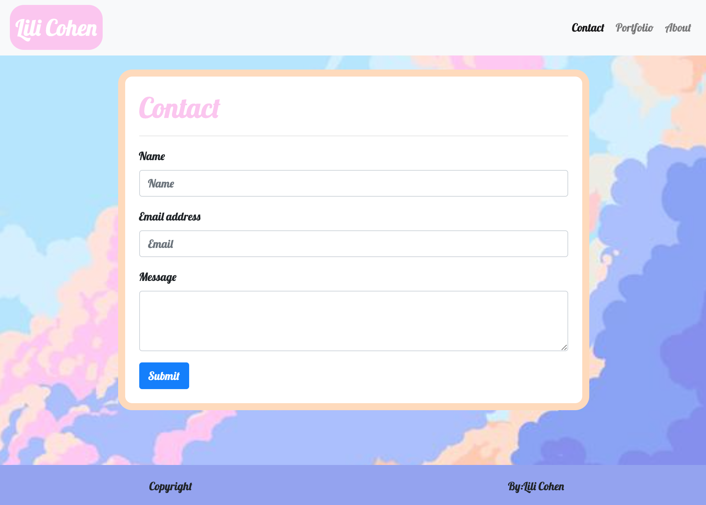
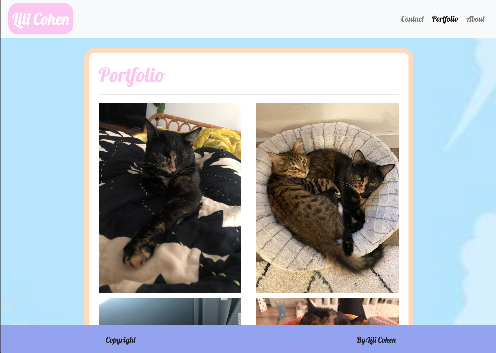
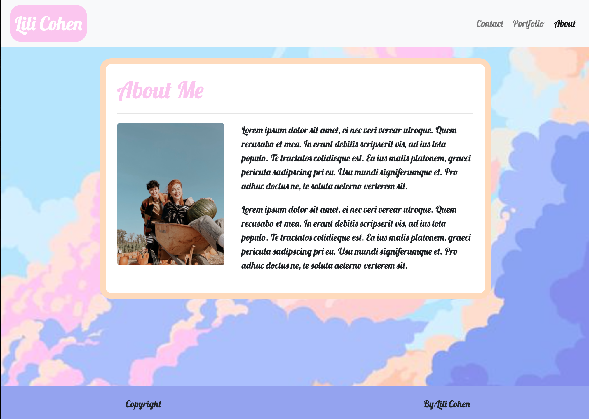

# hw-2
## Overview
For this project I had to create a similar template to that on the Gitlab homework page and ensure that each section of the index.html, portfolio.html, contact.html all were responsive for small, medium, and large screens using as little media queries as possible and relying mainly on Bootsrtap inputs. 

I had to use a navbar with a dropdown menu and workable links to each page, a sticky footer, as well as custom css to make my pages look almost exactly like the homework template. I did this by using my knowledge of html, css and the internet. I used containers, columns and rows on my main content to create responsiveness without the use of media queries. 

[Link](https://lilipcohen.github.io/hw-2/)